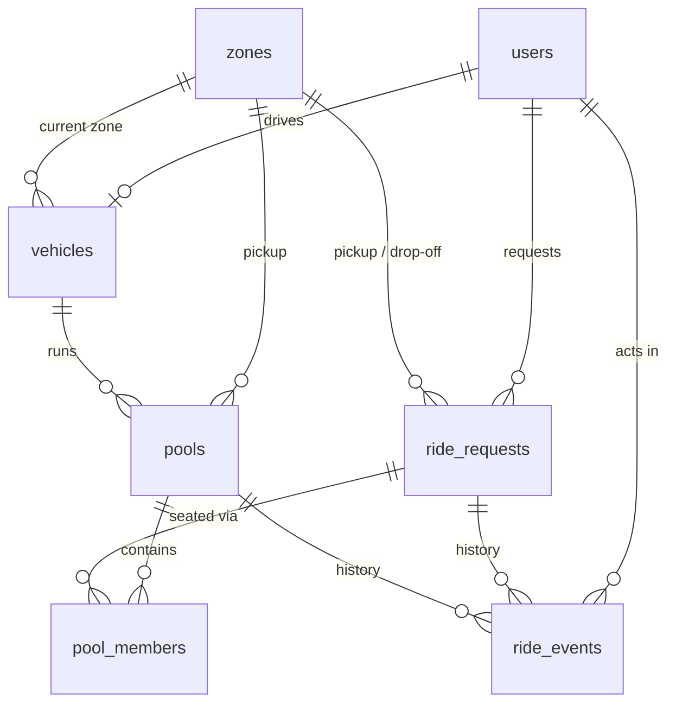

# Dhaka Tesla Pool — MVP Design Spec

- **Date:** 2026-09-26
- **Status:** Approved in design review, pending spec review
- **Source brief:** RoBenDevs internship PRD, "Dhaka Tesla Pool"

## 1. Goal and success criteria

Build a ride-pooling MVP. Passengers request rides. Jashim's three-seat Tesla, "Bullet", accepts them and shares the trip. Each passenger pays their own fare. The whole system starts with `docker compose up`.

Success depends as much on **process** as on features:

- The Git history shows feature branches, pull requests, and conventional commits.
- The six risky behaviours from PRD §12 are covered by tests.
- The README covers every item the PRD lists.
- The story cast (Jashim, Bullet, Nusrat, Rafiq, Shirin) is used in the seed data, tests, docs, and demo.
- Every design choice can be explained in an interview.

**Out of scope for v1:** a TeslaPay wallet, ratings, real maps and routing, per-passenger drop-off, automatic expiry of stale requests, and real-time sockets.

## 2. Stack

| Layer | Choice | Realistic alternatives | Why it fits | What would make us switch |
|---|---|---|---|---|
| Frontend | React + Vite + React Router + Tailwind | Next.js App Router | The UI is purely client-side and talks to a separate API, so SSR adds nothing. The PRD allows plain React with a router. | SEO or public landing pages, or server-rendered first paint. |
| Backend | Node.js + Express 5 + TypeScript 5.9 | NestJS, Fastify | There's no hidden magic: each request flows middleware → route → service → DB. This is the easiest stack to defend line by line. | A larger team would benefit from NestJS module and DI conventions. A throughput bottleneck would point to Fastify. |
| Database | PostgreSQL 16 | MySQL, SQLite | Row locks and conditional updates make capacity enforcement correct under concurrency. We also get CHECK constraints and partial unique indexes. SQLite serializes writes, so the race could never happen there. | None expected at MVP scale. Scaling notes are in §12. |
| DB access | Prisma 6 (pinned; schema, migrations, seed) plus raw SQL for the seat claim | Drizzle, Kysely, raw `pg` | The schema file reads like an ERD, and migrations and seeding are built in. The one concurrency-critical statement is plain SQL, so it's easy to see. | If much of the domain logic ends up in raw SQL, Kysely or Drizzle would fit better. |
| Auth | bcrypt + JWT (Bearer, 12h expiry) | Session cookies, Auth.js | Stateless auth that's simple to test with Supertest. Web and API deploy to different origins, so cookies would need SameSite=None and CORS credentials. | If XSS risk grows (the token lives in localStorage), switch to httpOnly cookies behind a same-origin proxy. |
| Validation | Zod | Joi, express-validator | One schema per request body, with inferred TypeScript types. | — |
| Tests | Vitest + Supertest against a real Postgres | Jest | Fast, TypeScript-native, and the same runner covers unit and integration tests. The concurrency test needs a real database. | — |
| Logging | pino + pino-http | winston, morgan | Structured JSON logs with a request ID, and cheap to run. | — |
| Hosting | Neon (Postgres) + Render (API Docker service) + Vercel or Netlify (static web) | Railway, Fly.io | All three have free tiers and none needs a credit card. Free tiers are re-checked at deploy time, and reproducible Docker is the documented fallback. | Paid tiers once there's real traffic, which removes Render's cold starts. |

## 3. Domain rules

### 3.1 Geography: zones on a 1 km grid

Each zone has integer grid coordinates in km, measured relative to Banani:

| Zone | (x, y) | Zone | (x, y) |
|---|---|---|---|
| Banani | (0, 0) | Farmgate | (−2, −4) |
| Mohakhali | (0, −2) | Dhanmondi | (−3, −5) |
| Gulshan 1 | (1, −2) | Mirpur | (−4, 1) |
| Gulshan 2 | (1, 0) | Uttara | (−3, 9) |
| Bashundhara | (5, 3) | | |

Distance between zones is Manhattan distance, `|Δx| + |Δy|` km. Dhaka traffic doesn't travel in straight lines, and anyone can check this by hand.

Worked distances:
- Banani → Mohakhali = 2 km
- Banani → Gulshan 1 = 3 km
- Mohakhali ↔ Gulshan 1 = 1 km

### 3.2 Compatibility rule (pool matching)

A ride request R can join a pool P only when all four conditions hold:

1. `R.pickupZone == P.pickupZone`
2. R's drop-off zone is **≤ 2 km** from the drop-off of **every** active member of P (the "destination cluster" rule).
3. `P.seatsTaken + R.seats <= P.capacity`
4. `P.status ∈ {OPEN, DRIVER_ARRIVED}`, meaning the trip hasn't started yet.

Checking this against the cast:
- Nusrat (Banani → Mohakhali) and Rafiq (Banani → Gulshan 1): the destinations are 1 km apart, so they're compatible.
- A Banani → Uttara rider is 14 km from Mohakhali, so they're incompatible.

### 3.3 Fare model

All money is stored as **integer paisa**. Column names end in `_paisa`, and 1 BDT = 100 paisa.

- **Why integers:** JavaScript numbers are IEEE-754 floats, and Postgres `NUMERIC` values come back from the driver as strings. Integers avoid both problems.
- **Rounding:** the only rounding step is the discount (`Math.round`). With the current constants the subtotal is always a multiple of 1000, so the discount never actually needs rounding.

```
BASE_FARE_PAISA      = 3000   (৳30)
PER_KM_PAISA         = 2000   (৳20)
POOL_DISCOUNT_PCT    = 25

subtotal      = (BASE_FARE_PAISA + PER_KM_PAISA × distanceKm) × seats
poolDiscount  = pooled ? round(subtotal × POOL_DISCOUNT_PCT / 100) : 0
passengerFare = subtotal − poolDiscount
```

- `distanceKm` is the rider's **own** pickup → drop-off distance.
- A ride counts as `pooled` when the pool has **at least 2 active ride requests at the moment it STARTS**.

| | Nusrat → Mohakhali | Rafiq → Gulshan 1 |
|---|---|---|
| distance | 2 km | 3 km |
| subtotal | 3000 + 2×2000 = 7000 | 3000 + 3×2000 = 9000 |
| discount (25%) | 1750 | 2250 |
| **pooled fare** | **5250 = ৳52.50** | **6750 = ৳67.50** |
| solo fare | 7000 = ৳70.00 | 9000 = ৳90.00 |

**Fare lifecycle:**

1. **At request time**, the system computes and stores `estimate_solo_paisa` and `estimate_pooled_paisa`, and the UI shows both.
2. **At STARTED**, the final fare is **locked** into the four `fare_*` columns. From then on the stored breakdown is the fare: it is never recomputed.
3. If a co-rider cancels before the start, the remaining rider pays the solo fare.

**Payment:** cash. The locked `fare_total_paisa` is the amount Jashim collects when he completes the trip.

### 3.4 Lifecycles

Two state machines work together. The **pool** is the trip, seen from Jashim's side. The **ride request** is one passenger's ticket.

```
POOL:          OPEN → DRIVER_ARRIVED → STARTED → COMPLETED
               OPEN | DRIVER_ARRIVED → CANCELLED

RIDE REQUEST:  REQUESTED → MATCHED → DRIVER_ARRIVED → STARTED → COMPLETED
               REQUESTED | MATCHED | DRIVER_ARRIVED → CANCELLED
               MATCHED | DRIVER_ARRIVED → REQUESTED   (only when the driver cancels the pool)
```

How this changes the PRD's suggested lifecycle, and why:

- **MATCHED and ACCEPTED merge into one state.** Under auto-join, a rider holds a seat either because the driver accepted them or because the system matched them into an open pool. Both cases mean "has a seat". The acceptance itself is recorded by the pool existing and by `ride_events`.
- **Pool and request states are separate.** A passenger's status (their own ticket) and the vehicle's trip are different things. Keeping them apart makes per-passenger privacy and history straightforward.
- **Pool transitions cascade.** `arrive`, `start`, and `complete` update the pool and every active member request **in one transaction**, and write one `ride_events` row per changed entity.

Passenger-facing labels:

| Request state | Label shown |
|---|---|
| REQUESTED | "Waiting for a Tesla" |
| MATCHED | "Matched" |
| DRIVER_ARRIVED | "Bullet is here" |
| STARTED | "On the way" |
| COMPLETED | "Completed" |
| CANCELLED | "Cancelled" |

**Rules:**

1. **Joining.** A pool accepts riders until it is STARTED. It stops accepting when it's full. A full pool shows the driver "Bullet is full — ready to go". The trip never starts automatically: the driver always taps **Start**.
2. **Transitions are strict.** A pool must go OPEN → DRIVER_ARRIVED before STARTED. Any other transition gets `409 INVALID_TRANSITION`.
3. **Passenger cancel** is allowed from REQUESTED, MATCHED, or DRIVER_ARRIVED, and not from STARTED onwards. For a matched rider, cancelling sets `pool_members.left_at`, frees their seats, and sets `cancelled_by = PASSENGER`. If the pool is then empty, it becomes CANCELLED.
4. **Driver cancel** is allowed from OPEN or DRIVER_ARRIVED. The pool becomes CANCELLED. Every active member's `left_at` is set, `seats_taken` goes back to 0, and each member request **returns to REQUESTED**. Riders are re-queued, not punished for the driver cancelling. After the cancellation commits, each re-queued ride immediately tries to auto-join another open pool, using the same process as a new request.
5. **One active of each.** A passenger has at most one active request (REQUESTED, MATCHED, DRIVER_ARRIVED, or STARTED). A vehicle has at most one active pool. Both rules are enforced by partial unique indexes.
6. **Going offline.** A driver can't go offline while their vehicle has an active pool. Going online requires choosing a current zone.
7. **Seats per request.** A request asks for 1 to `MAX_SEATS_PER_REQUEST = 3` seats, which is the largest vehicle in the fleet.

### 3.5 Matching flow (option A: open pool + auto-join)

**`POST /api/rides`** runs these steps inside one request:

1. Validate the input and compute distance and estimates.
2. Insert the request as `REQUESTED`.
3. Find candidate pools. A candidate matches rules 1, 2, and 4 of §3.2 and has enough free seats. Order candidates by `seats_taken DESC` (fill fuller pools first), then `created_at ASC`.
4. For each candidate, call `claimSeats()` (§5). Stop at the first success, and the request becomes `MATCHED`. If a claim fails because another request won the race, move on to the next candidate.
5. If no candidate succeeds, the request stays `REQUESTED`. The response is `201` either way, with the resulting status.

**Driver side:**

- **Relevant requests:** `GET /api/driver/requests` returns `REQUESTED` rides with `pickup = driver's current zone` and `seats ≤ free seats`. If the driver already has a pool, the list only includes requests compatible with it.
- **Accepting:** `POST /api/driver/requests/:id/accept` requires the driver to be online, and has two cases:
  - **No active pool:** create a pool (OPEN, `capacity` copied from the vehicle, pickup = the request's pickup, which must equal the driver's zone), then call `claimSeats`.
  - **Active pool:** call `claimSeats` into it. This returns `409 INCOMPATIBLE` if the request fails §3.2, or `409 NO_SEATS` / `409 ALREADY_MATCHED` if it lost a race.

## 4. Data model (PostgreSQL via Prisma)

Enums:
- `user_role`: PASSENGER, DRIVER
- `ride_status`: REQUESTED, MATCHED, DRIVER_ARRIVED, STARTED, COMPLETED, CANCELLED
- `pool_status`: OPEN, DRIVER_ARRIVED, STARTED, COMPLETED, CANCELLED
- `cancel_actor`: PASSENGER, DRIVER

| Table | Purpose | Key columns and constraints |
|---|---|---|
| `users` | Anyone who signs in | `id uuid PK`, `name`, `email UNIQUE`, `phone`, `password_hash`, `role`, `created_at` |
| `zones` | Seeded reference data for the geography | `id`, `name UNIQUE`, `grid_x int`, `grid_y int` |
| `vehicles` | A driver's Tesla and its availability | `id`, `driver_id UNIQUE FK users`, `name`, `plate UNIQUE`, `capacity CHECK 1..6`, `is_online bool`, `current_zone_id FK zones NULL`, `CHECK (NOT is_online OR current_zone_id IS NOT NULL)` |
| `ride_requests` | One passenger's ride ticket | `id uuid`, `passenger_id FK`, `pickup_zone_id FK`, `dropoff_zone_id FK`, `CHECK pickup≠dropoff`, `seats CHECK ≥1`, `distance_km int`, `status`, `cancelled_by NULL`, `estimate_solo_paisa`, `estimate_pooled_paisa`, `fare_base_paisa NULL`, `fare_distance_paisa NULL`, `fare_discount_paisa NULL`, `fare_total_paisa NULL`, `created_at`, `updated_at` |
| `pools` | One shared trip in one Tesla | `id uuid`, `vehicle_id FK`, `pickup_zone_id FK`, `capacity int` (copied from the vehicle), `seats_taken int DEFAULT 0`, `CHECK (seats_taken BETWEEN 0 AND capacity)`, `status`, `created_at`, `started_at`, `completed_at` |
| `pool_members` | Who is or was in which pool | `id`, `pool_id FK`, `ride_request_id FK`, `seats`, `joined_at`, `left_at NULL`, `left_reason NULL` |
| `ride_events` | Append-only audit trail ("what happened?") | `id bigserial`, `ride_request_id NULL FK`, `pool_id NULL FK`, `actor_user_id NULL FK` (NULL means the system), `type`, `from_status`, `to_status`, `metadata jsonb`, `created_at` |

Indexes:
- Partial unique index on `ride_requests(passenger_id)` WHERE the status is active
- Partial unique index on `pools(vehicle_id)` WHERE the status is active
- Partial unique index on `pool_members(ride_request_id)` WHERE `left_at IS NULL`
- `ride_requests(status, pickup_zone_id)`
- `pools(status, pickup_zone_id)`
- `pool_members(pool_id)`
- `ride_events(ride_request_id)` and `ride_events(pool_id)`

Prisma can't express partial unique indexes or CHECK constraints in its schema, so they're added by hand in the SQL migration.

Design notes:
- **`pools.capacity` is a copy of the vehicle's capacity.** A CHECK constraint can only see its own row, and the copy also stops a later capacity edit from affecting a trip that's already running.
- **`seats_taken` is a stored counter** rather than a `SUM` over members. That lets the seat claim be a single atomic conditional UPDATE, and the CHECK constraint backs it up. A test asserts that `seats_taken == SUM(active members.seats)`.
- **There's no payments table,** because the locked fare is the cash amount due. A wallet ledger is listed as a next improvement.



## 5. Concurrency

The pool row is the lock. `claimSeats(tx, poolId, requestId, seats, actor)` runs inside a single transaction:

```sql
UPDATE pools SET seats_taken = seats_taken + $seats
 WHERE id = $poolId AND status IN ('OPEN','DRIVER_ARRIVED')
   AND seats_taken + $seats <= capacity
RETURNING id;                                   -- 0 rows → NO_SEATS / POOL_CLOSED
UPDATE ride_requests SET status = 'MATCHED', updated_at = now()
 WHERE id = $requestId AND status = 'REQUESTED'; -- 0 rows → ALREADY_MATCHED → rollback
INSERT INTO pool_members …; INSERT INTO ride_events …;
```

How this works under READ COMMITTED isolation:
1. The first UPDATE takes a row lock on the pool.
2. A concurrent UPDATE on the same pool waits for that lock.
3. Once the first transaction commits, Postgres re-evaluates the waiting UPDATE's `WHERE` against the new row, so the loser sees `seats_taken + 1 > capacity` and updates 0 rows.
4. The CHECK constraint is the final safety net if any code path ever skips this logic.

Compatibility (§3.2) is checked **again after the pool row is locked**. Once the lock is held, nobody else can join, so the check can't race. If the ride turns out to be incompatible, the claim's transaction rolls back.

During auto-join, **each attempt runs in its own transaction**. The ride request is committed first, as REQUESTED, and a failed attempt on one pool never undoes it.

**Lock ordering:** every transaction that touches a pool locks the **pool row first**, then any request rows. For example, cancelling a matched ride first runs `SELECT … FROM pools WHERE id = $poolId FOR UPDATE`. A consistent order prevents deadlocks.

Races and how each is handled:

| Race | Outcome |
|---|---|
| Nusrat and Shirin both try to take Bullet's last seat | Exactly one is MATCHED. The other stays REQUESTED. |
| Two drivers accept the same request | The request's `status = 'REQUESTED'` guard lets only one succeed. The other gets 409 ALREADY_MATCHED. |
| A rider auto-joins while the driver presses Start | The claim's `status IN (...)` check is re-evaluated after the lock, so it fails. |
| A passenger double-submits a ride request | The one-active-request partial unique index rejects the second insert with 409 ACTIVE_RIDE_EXISTS. |

**Test scenario (documented assumption).** The PRD contradicts itself. In §1 Nusrat is already pooled, yet in §12 she races Shirin for the last seat. The test resolves this with a separate scenario: Rafiq books **2 seats** in Bullet, then Nusrat and Shirin request at the same moment using `Promise.all`. The test asserts:
- exactly one of them is MATCHED
- `seats_taken = 3`
- `SUM(active seats) = 3`

A second test variant runs 10 concurrent requesters.

## 6. API (REST, JSON, prefix `/api`)

| Method and path | Role | Notes |
|---|---|---|
| `GET /health` | public | Pings the DB. Returns 200 or 503. |
| `POST /auth/register` | public | Registers a **passenger** only. Drivers are seeded. |
| `POST /auth/login` | public | Returns `{ token, user }`. Rate-limited. |
| `GET /me` | any | The current user. Drivers also get their vehicle. |
| `GET /zones` | any | The zone list with grid coordinates. |
| `POST /fares/estimate` | passenger | `{pickupZoneId, dropoffZoneId, seats}` → `{distanceKm, soloPaisa, pooledPaisa}` |
| `POST /rides` | passenger | Creates a request and tries to auto-join a pool. Returns 201 with the status. |
| `GET /rides` | passenger | The caller's own rides, newest first. |
| `GET /rides/:id` | passenger (owner) | The ride, a privacy-filtered view of its pool, and its events. Returns 404 if the ride isn't the caller's. |
| `POST /rides/:id/cancel` | passenger (owner) | Follows §3.4 rule 3. |
| `PUT /driver/availability` | driver | `{online, zoneId?}`. Returns 409 if the driver tries to go offline with an active pool. |
| `GET /driver/requests` | driver | Relevant REQUESTED rides. |
| `POST /driver/requests/:id/accept` | driver | Follows §3.5. |
| `GET /driver/pool` | driver | The active pool with its members, or `null`. |
| `GET /driver/history` | driver | Completed and cancelled pools. |
| `POST /pools/:id/arrive` · `/start` · `/complete` · `/cancel` | driver (owner of the pool's vehicle) | Pool transitions. Returns 404 if the pool isn't the driver's own. |

**Privacy filter.** A passenger's view of their pool shows the driver's name, the vehicle, the pool status, and `coRiderCount`. It never shows other riders' names, destinations, or fares. The driver's view shows each rider's first name, seats, drop-off zone, and fare, because Jashim collects the cash.

**Errors.** Every error response has the shape `{ error: { code, message, details? } }`.

| Status | Codes |
|---|---|
| 400 | VALIDATION_ERROR |
| 401 | UNAUTHENTICATED, INVALID_CREDENTIALS |
| 403 | FORBIDDEN_ROLE |
| 404 | NOT_FOUND (also used for another user's resources) |
| 409 | INVALID_TRANSITION, NO_SEATS, POOL_CLOSED, ALREADY_MATCHED, INCOMPATIBLE, ACTIVE_RIDE_EXISTS, ACTIVE_POOL_EXISTS, DRIVER_OFFLINE, WRONG_ZONE, EMAIL_TAKEN, CONFLICT |
| 413 | PAYLOAD_TOO_LARGE |
| 429 | RATE_LIMITED |
| 500 | INTERNAL (details go to the log, not the client) |

Why REST: the API has few resources, and its state changes are commands, which fit action endpoints well. Each endpoint is simple to test with one Supertest call. GraphQL's advantages (flexible fetching for many different clients) don't apply here.

## 7. Backend structure

```
api/
  prisma/schema.prisma, migrations/, seed.ts
  src/
    app.ts            express app: helmet, cors, json, pino-http, routes, errorHandler
    server.ts         listen + graceful shutdown
    config.ts         reads and validates env with Zod (fails fast)
    domain/           PURE: fare.ts, geo.ts, transitions.ts, constants.ts
    services/         authService, rideService, poolService, driverService, claimSeats.ts
    routes/           auth, zones, fares, rides, driver, pools, health
    middleware/       authenticate, requireRole, validate(schema), errorHandler
    lib/              AppError, prisma client, logger
  test/unit/, test/integration/ (with helpers to reset the DB and log in as the cast)
```

Where each concern lives:

| Concern | Location |
|---|---|
| HTTP parsing and response shaping | `routes/` |
| Business rules and transactions | `services/` |
| Deterministic math and state tables | `domain/` |

**Security:**
- bcrypt with cost 10
- JWT signed with HS256, secret loaded from env, 12-hour expiry
- helmet
- CORS allow-list taken from `CORS_ORIGIN`
- express-rate-limit on the `/auth/*` routes
- request body size limit
- secrets never logged

**Logging:** each request gets its own ID and a structured log line. Every state transition is logged at info level.

## 8. Frontend

React with Vite, React Router, and Tailwind.

| Route | Content |
|---|---|
| `/login`, `/register` | Login and passenger sign-up. Includes demo-login buttons for Jashim, Nusrat, Rafiq, and Shirin. |
| `/ride` | **No active ride:** a request form (pickup, drop-off, seats 1–3) with a live solo/pooled estimate. **Active ride:** a status stepper (polled every 3 s), the driver and vehicle, "sharing with N other(s)", the fare (estimate, or the locked fare once started), and a Cancel button when cancelling is allowed. |
| `/history` | Past rides with the fare breakdown and an event timeline. |
| `/driver` | Online toggle and zone picker. **No pool:** the relevant-requests list with Accept buttons. **Pool active:** the rider list, a seat meter (e.g. ●●○ 2/3), a next-action button (Arrived → Start → Complete), and Cancel pool. |
| `/driver/history` | Past pools. |

- **Route guards** by role: a passenger who visits `/driver` is redirected.
- **`useApi(fn, { pollMs })`** returns `{ data, error, loading, refetch }`. Each view shows an explicit loading state, an error state with a retry button, and an empty state. For example: "No one in Banani needs a Tesla right now."
- **Tokens** are stored in localStorage. The XSS trade-off is documented.
- **API errors** are mapped to human-readable messages, e.g. 409 NO_SEATS becomes "Bullet just filled up — you're still in the queue."

## 9. Seed data (idempotent upserts)

Password for every demo user: `bullet123`. This is documented as demo-only.

- **Zones:** all nine from §3.1.
- **Jashim** (driver, `jashim@teslapool.test`) with **Bullet** (capacity 3, plate `DHK-TESLA-11`). Starts offline.
- **Monir** (driver, `monir@teslapool.test`) with **Toofan** (capacity 2). This is a cast addition, used for the two-drivers race and the re-queue demo.
- **Passengers:**
  - Nusrat (`nusrat@teslapool.test`)
  - Rafiq (`rafiq@teslapool.test`)
  - Shirin (`shirin@teslapool.test`)
- **History:** one COMPLETED pool from "yesterday". Nusrat and Rafiq rode in Bullet, with locked fares of ৳52.50 and ৳67.50 and a full event trail, so the history screens aren't empty.

## 10. Docker and deployment

Running `docker compose up` starts three services:

| Service | Setup |
|---|---|
| `db` | `postgres:16-alpine`, with a named volume and a `pg_isready` healthcheck |
| `api` | Multi-stage Node 24 image. `depends_on: db: service_healthy`. The entrypoint runs `prisma migrate deploy`, then the seed, then `node dist/server.js`. Healthcheck is `GET /api/health`. |
| `web` | Multi-stage image: the Vite build served by nginx. nginx proxies `/api/` to `api:4000`, so the browser sees a single origin. |

- `.env.example` lists: `DATABASE_URL`, `JWT_SECRET`, `JWT_EXPIRES_IN`, `PORT`, `CORS_ORIGIN`, `LOG_LEVEL`, `POSTGRES_USER`, `POSTGRES_PASSWORD`, `POSTGRES_DB`, `VITE_API_URL`. `.env` is gitignored.
- **Tests** use a separate `tesla_pool_test` database on the same Postgres container, created by an init script.
- **Public deployment** is built from `release/v1.0.0`: Neon Postgres, the Render Docker web service for the API, and Vercel or Netlify for the web app (with `VITE_API_URL` pointing at Render). The README documents Render's free-tier cold start. If any provider's free tier isn't available, the fallback is the reproducible Docker instructions.

## 11. Testing

**Unit tests (Vitest, pure functions):**
- `fare`: Nusrat 5250 pooled and 7000 solo, Rafiq 6750 pooled and 9000 solo, and the seats multiplier
- `geo`: distances, compatibility (Mohakhali and Gulshan 1 are compatible, Uttara is not)
- `transitions`: every allowed and disallowed pair

**Integration tests (Vitest + Supertest against the real test DB, reset between tests):**

| PRD §12 requirement | Tests |
|---|---|
| Capacity is never exceeded | A 4th seat is rejected. A 2-seat request doesn't fit when only 1 seat is free. `seats_taken == SUM(active member seats)`. |
| Invalid transitions are rejected | e.g. starting a pool from OPEN, completing from OPEN, or a passenger calling `/pools/:id/start` → 409 or 403 |
| Pooled fares are correct | End to end: Nusrat and Rafiq pooled, Jashim starts the trip, the locked fares are 5250 and 6750. If Rafiq cancels before the start, Nusrat pays 7000. |
| One user can't modify another's ride | Rafiq calling GET or cancel on Nusrat's ride gets 404. Monir can't start Jashim's pool. |
| Cancellation rules hold | Cancelling after STARTED gets 409. The last rider leaving auto-cancels the pool. A driver cancel re-queues riders to REQUESTED. |
| Concurrent requests can't corrupt capacity | The §5 scenario, plus 10 concurrent requesters, plus two drivers accepting one request |

**CI:** GitHub Actions runs a Postgres service container, `npm ci`, the migrations, and the tests for `api/`, and runs lint and build for `web/`. It's triggered on pull requests and on pushes to `master`, `pre-release`, and `release/**`.

## 12. Git workflow

1. `git init -b master`, then a public GitHub repo under `rakib4123`.
2. The first commit on `master` contains `.gitignore`, a README skeleton, and this spec.
3. Each feature is built on `feature/*` with incremental conventional commits (`feat|fix|refactor|test|docs|chore|build(scope): …`), then merged through a PR with `--no-ff`. Planned branches, in order:
   1. `feature/api-foundation`
   2. `feature/database-schema`
   3. `feature/passenger-auth`
   4. `feature/fare-and-zones`
   5. `feature/ride-requests`
   6. `feature/tesla-pooling`
   7. `feature/driver-flow`
   8. `feature/web-foundation`
   9. `feature/web-passenger`
   10. `feature/web-driver`
   11. `feature/docker-compose`
   12. `feature/ci`
4. `pre-release` is cut from `master` for README completion, diagrams, deployment, and integration fixes.
5. `release/v1.0.0` is cut from `pre-release`. It is the deployed version and the one shown in the video.

Commits are authored by the user and carry a `Co-Authored-By: Claude` trailer, which is consistent with the README's AI Usage section.

## 13. README outline

The README follows PRD §12 item by item:

- Summary and problem statement
- Features and screenshots
- Architecture diagram (Mermaid) and ERD
- Tech stack, using the §2 table
- Project structure and prerequisites
- Environment variables
- Local setup, Docker, and migrations and seed
- How to run the app and the tests
- Demo credentials
- Deployment URL
- API overview
- Key decisions and trade-offs, plus an **Assumptions** section (§14)
- The fare worked example
- The concurrency explanation
- Known limitations and next improvements
- AI Usage (tools, purposes, one accepted and one rejected suggestion)
- Demo video link
- The "If Oi Tesla Goes Viral" scaling bonus (§15)

## 14. Assumptions (to be copied into the README)

1. Passengers sign up themselves. Drivers are provisioned through the seed, since the PRD gives drivers "sign in" only.
2. Each driver owns exactly one vehicle, and its capacity is fixed.
3. Geography is a fixed grid of zones with Manhattan distances. Pickups are at the zone level.
4. Matching uses the §3.2 rule and happens synchronously during `POST /rides` ("in about a second").
5. The pool discount applies only if the ride is actually pooled at STARTED. Estimates are not binding.
6. Every pool member is dropped off when the pool completes. Separate per-passenger drop-off is a known limitation.
7. Stale REQUESTED rides don't expire automatically. The passenger cancels them.
8. The concurrency test uses the "Rafiq booked 2 seats" scenario to reconcile PRD §1 and §12. PRD §18 refers to "Section 14" for the concurrency problem, but it is actually in §12.
9. Payment is in cash only, and the locked fare is the amount due.
10. Monir and Toofan are a documented addition to the cast, used for the multi-driver scenarios.

## 15. Scaling bonus (write-up only, not built)

The README's bonus section covers:

- Stateless API replicas behind a load balancer
- Postgres read replicas for history, and partitioning or sharding matching by city or zone
- Geospatial indexes (PostGIS or H3 cells) to replace the grid
- Per-zone matching workers fed by a queue once contention on hot pools justifies it
- Idempotency keys on `POST /rides`
- Optimistic concurrency with `version` columns
- Replacing polling with WebSockets or SSE
- Per-user and per-IP rate limiting
- Observability: RED metrics, tracing, and SLOs on match latency
- Retries with backoff, and an outbox for events
- Blue/green deploys

Each item is paired with the signal that would justify it.
